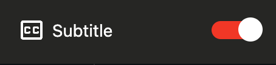
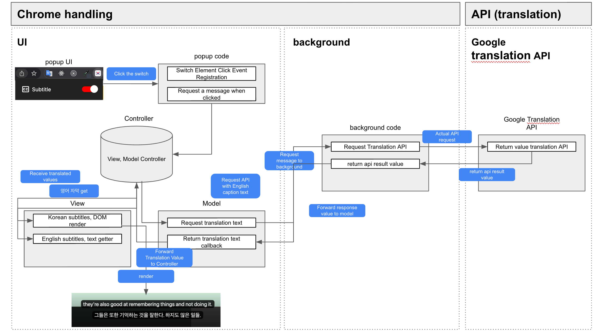

   
   <h1>Closed Caption Extension</h1>
   <strong>Let's check English and Korean subtitles together  and understand and enjoy the contents more easily and quickly</strong>
   <h5>Break down the wall of one-click language</h5>

## 🔖 closed caption korean extension

> Closed caption Korean is an extension program that helps 
> you see English and Korean subtitles together. 🧑‍💻

If you look at only one translated caption or if you look at the existing subtitles, 
there are many difficulties in watching, such as incorrect translation.

## 🚀 Sites where this chrome extensions are available

**Frontend masters**, **udemy**, and **YouTube** sites are supported. 
I'm going to support more sites! 🧑‍💻

   

## 🌈 Using closed caption extension

    
        

## 🕍 Architecture

