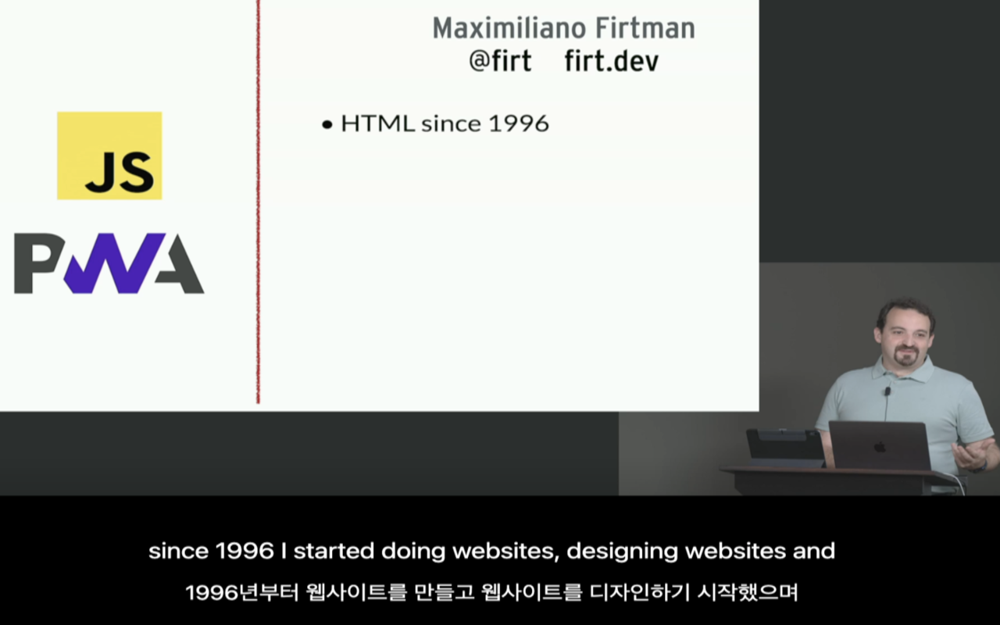
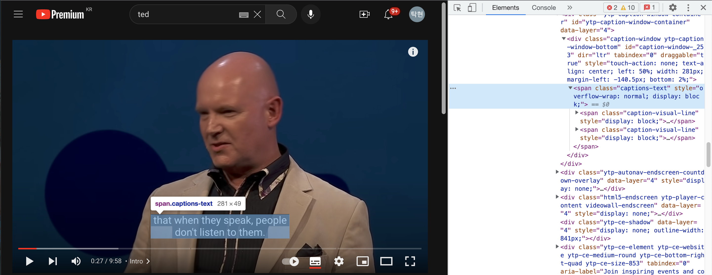
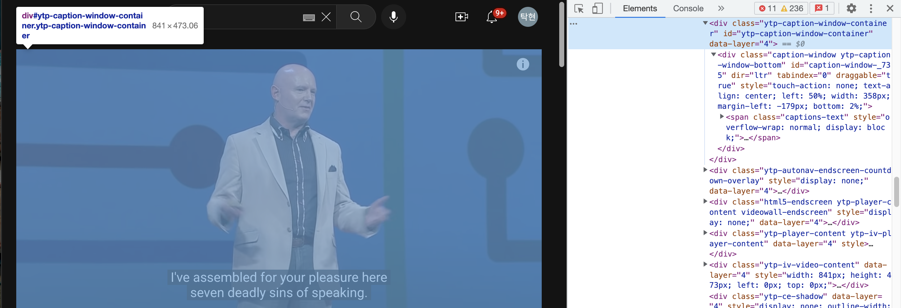
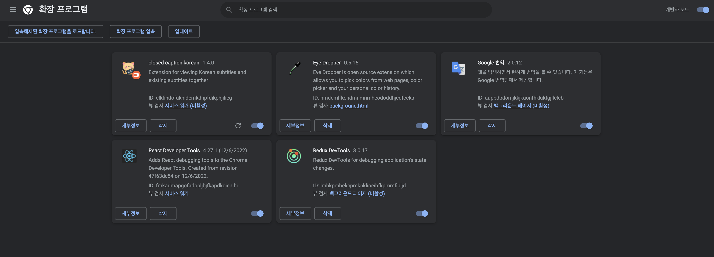
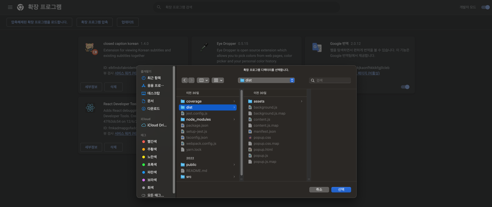

   
   <h1>Closed Caption Extension</h1>
   <strong>Let's check English and another language subtitles together  and understand and enjoy the contents more easily and quickly</strong>
   <h5>Break down the wall of one-click language</h5>

## 🔖 closed caption extension

> Closed caption is an extension program that helps 
> you see English and another subtitles together. 🧑‍💻

If you look at only one translated caption or if you look at the existing subtitles, 
there are many difficulties in watching, such as incorrect translation.

   

## 🚀 Sites where this chrome extensions are available

- [Netflix](https://www.netflix.com/)
- [Youtube](https://www.youtube.com/)
- [Frontend masters](https://frontendmasters.com/)
- [udemy](https://www.udemy.com/)
- [TED](https://www.ted.com/)

  I'm going to support more sites! 🧑‍💻

## 🌈 Using closed caption extension

    

## 🕍 Architecture

## 🧐 How to update website?

1. Add the site URL that you add to the content_scripts matched array in the manifest.

2. add the closed caption dom attribute to Dom info

### 🤔 how to select dom attribute?

Two pieces of information need to be added `domWrapperAttrs` and `domAttrs`.

First, `domAttrs` means the class, 
id of the upper tag surrounding the dom showing subtitles on the screen.

This is the information of the tag surrounding the two doms 
with the caption-visual-line class as shown in the image below.

Second, `domWrapperAttrs` means the upper dom of domAttrs. 
However, domWrapperAttrs must be specified as the dom where the change occurs  
when the subtitle changes.

If you put these two information and added website information to the manifest, please see the contents below.

### 🤔 how to develop in local

1. Form the build file through the yarn build script.

2. To register an extension, go to the Development of an extension page.
   

3. Apply build file to extension page.
   

4. Activate the added Closed Caption.

5. Test the active extension at each site.

6. If there is any change, please refresh the extension developer page and test it again.

### 🔖 Reference

- [chrome extension guide](https://developer.chrome.com/docs/extensions/mv3/devguide/)
