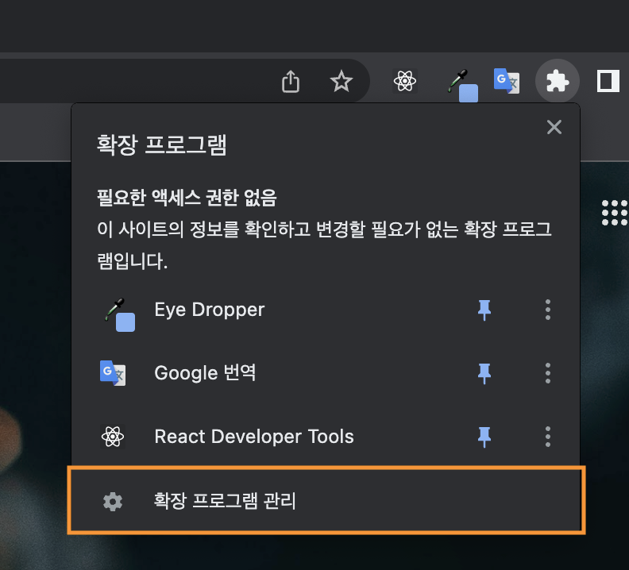
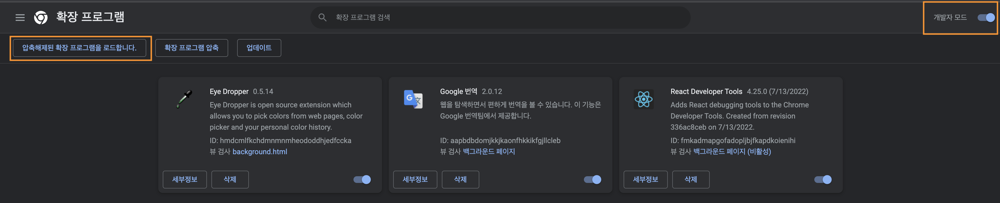
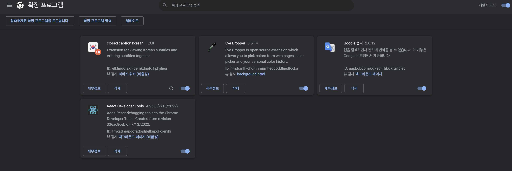

## closed caption korean extension?

영어 자막과 한글 자막을 함께 띄우는 목적을 가진 크롬 익스텐션입니다.<br />
현재는 frontend masters, udemy, youtube 사이트를 지원합니다.<br />
추후 적용 가능한 사이트를 늘려나갈 계획입니다.

## 사이트 지원을 위한 실행 방법

```bash
yarn install

yarn run build
```

위 script 를 통해 빌드 파일 생성 후, 크롬 익스텐션 개발자 모드에서 이를 등록, 사용해야합니다.<br />

### 실행을 위한 설명 (배포 환경)

[Chrome Extension 배포 URL](https://chrome.google.com/webstore/detail/closed-caption-korean/pjfhdffkbjfneojiamjnooaagomkimde?hl=ko)

### 실행을 위한 설명 (로컬 환경에서 실행)

1. `yarn run script` 명령어를 실행하여 build 파일을 생성합니다.
2. 아래 이미지에서 박스로 표기된 확장 프로그램 관리를 클릭합니다.<br />
   
3. 개발자 모드를 활성화한 후 `압축해제된 확장 프로그램을 로드합니다.` 버튼을 클릭합니다.<br />
   
4. closed-caption extension 프로젝트의 빌드 파일을 클릭하면,<br />
   아래 이미지와 같이 크롬 익스텐션이 추가된 것을 확인하실 수 있습니다.
   
5. frontend masters 홈페이지에서 익스텐션을 활성화한 후 <br />
   크롬 익스텐션의 translate 버튼을 클릭합니다.<br />
   

## What is closed caption korean extension

closed caption korean is a chrome extension that<br />
displays both English and Korean subtitles in the current frontend masters.

## How to run for site support

```bash
yarn install

yarn run build
```

Please register the dist file in Chrome extension developer mode and use it..<br />

### How to use chrome in developer mode (in deployment environment)

[Chrome Extension deployment URL](https://chrome.google.com/webstore/detail/closed-caption-korean/pjfhdffkbjfneojiamjnooaagomkimde?hl=ko)

### How to use chrome in developer mode (in local environment)

1. Create a build file with `yarn run build`
2. In the chrome tab, click the box in the image below<br />
   
3. active the Developer mode and Click the Load unpacked<br />
   
4. select the closed-caption's build file and you can see the chrome-extension of this project
   
5. After enabling translation on the frontend masters homepage, <br />
   click the translate button in the chrome extension.<br />
   
